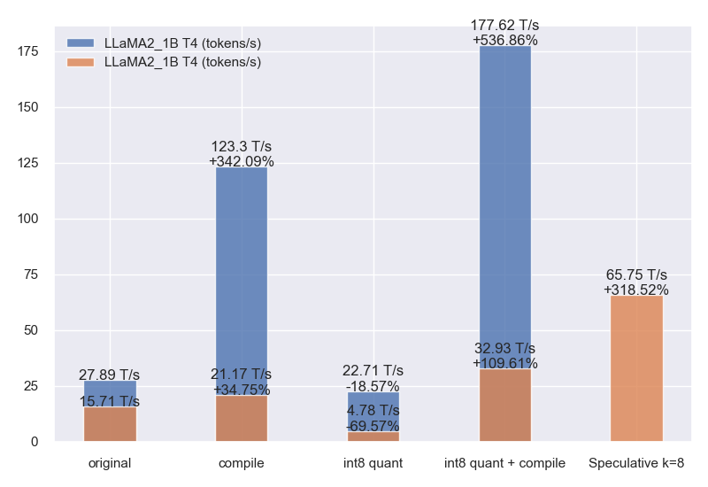

# Workflow
## Links
  - [Github pytorch-labs/gpt-fast](https://github.com/pytorch-labs/gpt-fast)
  - [Colab gpt_fast_test.ipynb](https://colab.research.google.com/drive/1C3w-jI3BinXuqDqaS3e2lvU8TUkOf0nH?usp=sharing)
  - Install torch nightly from [Start Locally Torch](https://pytorch.org/get-started/locally/)
    ```sh
    pip3 install --pre torch torchvision torchaudio --index-url https://download.pytorch.org/whl/nightly/cu121
    pip3 install --pre torch torchvision torchaudio --index-url https://download.pytorch.org/whl/nightly/cu118
    pip3 install --pre torch torchvision torchaudio --index-url https://download.pytorch.org/whl/nightly/cpu
    ```
  - **Int8 / Int4 Quant -> Tensor Parallel -> To device and precission -> Compile -> Speculative**
## LLaMA2_1B weights
  ```py
  import os
  os.environ['KECAM_BACKEND'] = 'torch'

  if not os.path.exists("llama2_1b.pt"):
      from keras_cv_attention_models import llama2
      mm = llama2.LLaMA2_1B()
      mm.half().save_weights("llama2_1b.pt")
  ```
## LLaMA2_7B weights
  ```sh
  pip install huggingface
  huggingface-cli login
  git config --global credential.helper store
  ```
  ```py
  import os
  from huggingface_hub import hf_hub_download
  aa = hf_hub_download(repo_id="meta-llama/Llama-2-7b-chat-hf", filename="pytorch_model-00001-of-00002.bin")
  os.rename(os.path.realpath(aa), os.path.basename(aa))  # Move to current dir

  aa = hf_hub_download(repo_id="meta-llama/Llama-2-7b-chat-hf", filename="pytorch_model-00002-of-00002.bin")
  os.rename(os.path.realpath(aa), os.path.basename(aa))  # Move to current dir
  ```
  ```py
  from keras_cv_attention_models import llama2
  _ = llama2.convert_huggingface_weights_to_h5("pytorch_model-00001-of-00002.bin", to_fp16=True)
  # >>>> Save to: pytorch_model-00001-of-00002.h5
  _ = llama2.convert_huggingface_weights_to_h5("pytorch_model-00002-of-00002.bin", to_fp16=True)
  # >>>> Save to: pytorch_model-00002-of-00002.h5
  ```
  ```py
  import os
  os.environ['KECAM_BACKEND'] = 'torch'

  from keras_cv_attention_models import llama2
  mm = llama2.LLaMA2_7B(pretrained=["pytorch_model-00001-of-00002.h5", "pytorch_model-00002-of-00002.h5"])
  # >>>> Load pretrained from: pytorch_model-00001-of-00002.h5
  # >>>> Load pretrained from: pytorch_model-00002-of-00002.h5
  mm.half().save(mm.name + ".pt")  # mm.half().save(mm.name + ".h5")
  ```
## Run parallel
  ```py
  import os
  import torch
  from typing import List, Optional

  def maybe_init_dist() -> Optional[int]:
      try:
          rank = int(os.environ.get("LOCAL_RANK", "0"))  # provided by torchrun
          world_size = int(os.environ.get("LOCAL_WORLD_SIZE", "1"))  # provided by torchrun
          print(f"{rank = }, {world_size = }")

          if world_size < 2:
              return None  # too few gpus to parallelize, tp is no-op
      except KeyError:
          return None  # not run via torchrun, no-op

      backend = "nccl" if torch.cuda.is_available() and int(os.environ.get("CUDA_VISIBLE_DEVICES", "0")) >= 0 else "gloo"
      torch.distributed.init_process_group(backend=backend, rank=rank, world_size=world_size)
      return rank

  if __name__ == "__main__":
      print(f"{maybe_init_dist() = }")
  ```
  ```sh
  torchrun --standalone --nproc_per_node=2 torch_parallel.py
  ```
## Env
  ```py
  import os
  os.environ['KECAM_BACKEND'] = 'torch'

  import time
  import torch
  import torch._dynamo.config
  import torch._inductor.config
  import numpy as np
  import matplotlib.pyplot as plt

  if hasattr(torch._inductor.config, "coordinate_descent_tuning"):
      torch._inductor.config.coordinate_descent_tuning = True
  if hasattr(torch._inductor.config, "triton") and hasattr(torch._inductor.config.triton, "unique_kernel_names"):
      torch._inductor.config.triton.unique_kernel_names = True
  if hasattr(torch._inductor.config, "fx_graph_cache"):
      torch._inductor.config.fx_graph_cache = True # Experimental feature to reduce compilation times, will be on by default in future

  GLOBAL_DEVICE = "cuda" if torch.cuda.is_available() and int(os.environ.get("CUDA_VISIBLE_DEVICES", "0")) >= 0 else "cpu"
  GLOBAL_PRECISSION = torch.float16 if GLOBAL_DEVICE == "cuda" else torch.float32
  GLOBAL_DIST_BACKEND = "nccl" if GLOBAL_DEVICE =="cuda" else "gloo"
  GLOBAL_CONTEXT = torch.autocast(device_type=GLOBAL_DEVICE, dtype=GLOBAL_PRECISSION)

  from model import LLaMA2_1B, LLaMA2_7B
  tt = LLaMA2_1B()
  ss = torch.load('llama2_1b.pt')
  tt.load_state_dict({ii: ss['state_dict'][('_'.join(ii.split('.')[:-1]) + '.' + ii.split('.')[-1])] for ii in tt.state_dict().keys()})

  def decode_one_token(model, inputs, input_pos):
      out = model(inputs, input_pos)
      torch.cuda.synchronize()
      return out

  def timeit_model_decode(model, repeat=100, num_tokens=1):
      with torch.no_grad(), torch.device(GLOBAL_DEVICE):
          if hasattr(model, "setup_caches"):
              model.setup_caches(max_batch_size=1, max_seq_length=2048)
          print(">>>> Warmup")
          for id in range(5):
              inputs = torch.randint(low=0, high=32000, size=[1, num_tokens])
              input_pos = torch.arange(id * num_tokens, (id + 1) * num_tokens, dtype=torch.int64)
              print(decode_one_token(model, inputs, input_pos).shape)

          print(">>>> Repeat test")
          times = []
          for id in range(repeat):
              inputs = torch.randint(low=0, high=32000, size=[1, num_tokens])
              input_pos = torch.arange(id * num_tokens, (id + 1) * num_tokens, dtype=torch.int64)
              ss = time.time()
              out = decode_one_token(model, inputs, input_pos)
              times.append((time.time() - ss) * 1000)
      print("Mean of time(ms) token for the inner 80%:", np.mean(sorted(times)[len(times) // 10: -len(times) // 10]))
      return times
  ```
## Compile
  ```py
  tt = tt.to(device=GLOBAL_DEVICE, dtype=GLOBAL_PRECISSION).eval()
  times = timeit_model_decode(tt)
  plt.plot(times)

  global decode_one_token
  decode_one_token = torch.compile(decode_one_token, mode="reduce-overhead", fullgraph=True)
  times = timeit_model_decode(tt)
  plt.plot(times)
  ```
  ```py
  # 7B Speculative, k=8
  times = timeit_model_decode(tt, num_tokens=8)
  plt.plot(times)
  ```
## Int8 Quant
  ```py
  import torch
  import int8_quant

  quant_save_path = (tt.name if hasattr(tt, 'name') else tt.__class__.__name__) + '_int8.pth'
  if not os.path.exists(quant_save_path):
      print(">>>> Run int quant")
      quantized_state_dict = int8_quant.create_quantized_state_dict(tt)
      torch.save(quantized_state_dict, quant_save_path)
  else:
      print(">>>> Load quant pretrained from:", quant_save_path)
      quantized_state_dict = torch.load(quant_save_path)
  int8_quant.replace_linear_weight_only_int8_per_channel(tt)
  tt.load_state_dict(quantized_state_dict, assign=True)
  tt = tt.to(device=GLOBAL_DEVICE, dtype=GLOBAL_PRECISSION).eval()

  pp = tt.blocks[0].self_attn.q_proj.weight
  print(pp.device, pp.dtype, pp.shape)

  """ Run """
  times = timeit_model_decode(tt)
  plt.plot(times)

  global decode_one_token
  decode_one_token = torch.compile(decode_one_token, mode="reduce-overhead", fullgraph=True)
  times = timeit_model_decode(tt)
  plt.plot(times)
  ```
  ```py
  # 7B Speculative, k=8
  times = timeit_model_decode(tt, num_tokens=8)
  plt.plot(times)
  ```
## Int4 quant
  ```py
  import torch
  import int4_quant

  # CUDA only as torch.ops.aten._convert_weight_to_int4pack not supporting CPU
  tt = tt.to(device=GLOBAL_DEVICE, dtype=GLOBAL_PRECISSION).eval()
  groupsize = 128

  quant_save_path = (tt.name if hasattr(tt, 'name') else tt.__class__.__name__) + '_int4.g{}.pth'.format(groupsize)
  if not os.path.exists(quant_save_path):
      print(">>>> Run int quant")
      quantized_state_dict = int4_quant.create_quantized_state_dict(tt)
      torch.save(quantized_state_dict, quant_save_path)
  else:
      print(">>>> Load quant pretrained from:", quant_save_path)
      quantized_state_dict = torch.load(quant_save_path)
  int4_quant.replace_linear_int4(tt)
  tt.load_state_dict(quantized_state_dict, assign=True)
  tt = tt.to(device=GLOBAL_DEVICE, dtype=GLOBAL_PRECISSION).eval()

  pp = tt.blocks[0].self_attn.q_proj.weight
  print(pp.device, pp.dtype, pp.shape)

  """ Run """
  times = timeit_model_decode(tt)
  plt.plot(times)

  global decode_one_token
  decode_one_token = torch.compile(decode_one_token, mode="reduce-overhead", fullgraph=True)
  times = timeit_model_decode(tt)
  plt.plot(times)
  ```
  ```py
  # 7B Speculative, k=8
  times = timeit_model_decode(tt, num_tokens=8)
  plt.plot(times)
  ```
## Speculative
  ```py
  import os
  os.environ['KECAM_BACKEND'] = 'torch'

  import torch
  from keras_cv_attention_models import llama2
  draft = llama2.LLaMA2_1B().eval()
  target = llama2.LLaMA2_7B(pretrained="llama2_chat/llama2_7b_chat_hf.h5").eval()
  # draft = llama2.LLaMA2_42M()
  # target = llama2.LLaMA2_110M()
  draft.run_prediction.build()
  min_vocab_size = min(draft.output_shape[-1], target.output_shape[-1])

  inputs = "Q: Is it possible to learn Spanish in 21 days? A:"
  draft.run_prediction(inputs, max_new_tokens=10, top_k=1)
  target.run_prediction(inputs, max_new_tokens=10, top_k=1)

  speculate_k = 8
  temperature = 0.8
  inputs = "Q: Is it possible to learn Spanish in 21 days? A:"
  start_ids = np.array(draft.run_prediction.tokenizer.encode(inputs, add_sot=True))


  with torch.no_grad():
      draft_tokens, draft_probs = draft.run_prediction(inputs, max_new_tokens=speculate_k, top_k=1, temperature=temperature, return_token_and_probs=True)
      target_logits = target(np.concatenate([start_ids, draft_tokens])[None])[0].cpu().numpy()
  target_probs = target.run_prediction.softmax_numpy(target_logits / max(temperature, 1e-5), axis=-1)

  # target_sub_prob >= draft_sub_prob: always accept draft token
  # target_sub_prob < draft_sub_prob: draft_sub_prob/target_sub_prob prob to accept draft token
  target_start_pos = target_probs.shape[0] - speculate_k - 1
  draft_sub_prob = draft_probs[np.arange(0, speculate_k), draft_tokens]
  target_sub_prob = target_probs[np.arange(target_start_pos, target_start_pos + speculate_k), draft_tokens]
  accept_draft_prob = np.minimum(target_sub_prob / draft_sub_prob, 1)
  rejected_locations = np.nonzero(np.random.uniform(size=accept_draft_prob.shape) > accept_draft_prob)[0]
  print("draft_sub_prob:", draft_sub_prob)
  print("target_sub_prob:", target_sub_prob)
  print("rejected_locations:", rejected_locations)


  if rejected_locations.shape[0] == 0:  # All draft tokens have been accepted
      accept_length = speculate_k + 1
      last_token = target_probs[-1].argmax(-1)
      accept_tokens = np.concatenate([draft_tokens, last_token[None]])
  else:
      accept_length = rejected_locations[0]  # The first rejected
      draft_prob = draft_probs[accept_length, :min_vocab_size]
      target_prob = target_probs[target_start_pos + accept_length, :min_vocab_size]
      next_token = (target_prob - draft_prob).argmax()
      accept_tokens = np.concatenate([draft_tokens[:accept_length], next_token[None]])
  ```
## Tensor Parallel
  ```sh
  CUDA_VISIBLE_DEVICES=0,1,2,3 torchrun --standalone --nproc_per_node=4 tensor_parallel.py
  ```
***

# Results
  - **T4 + torch 2.3.0.dev202321222+cu121**
    | LLaMA2_1B            | ms/token | tokens/s | Speedup     |
    | -------------------- | -------- | -------- | ----------- |
    | original             | 35.85    | 27.89    |             |
    | compile              | 8.11     | 123.30   | 342.05%     |
    | int8 quant           | 44.04    | 22.71    | -18.60%     |
    | int8 quant + compile | 5.63     | 177.62   | **536.77%** |

    | LLaMA2_7B                              | ms/token                   | tokens/s | Speedup     |
    | -------------------------------------- | -------------------------- | -------- | ----------- |
    | original                               | 63.64                      | 15.71    |             |
    | compile                                | 47.23                      | 21.17    | 34.74%      |
    | int8 quant                             | 209.18                     | 4.78     | -69.58%     |
    | int8 quant + compile                   | 30.37                      | 32.93    | **109.55%** |
    |                                        |                            |          |             |
    | input [1, 8], compile                  | 72.03                      | 13.88    | **-11.65%** |
    | input [1, 8], int8 quant + compile     | 156.67 [???]               | 6.38     | -59.38%     |
    | LLaMA2_1B + LLaMA2_7B, Speculative k=8 | 15.21 (assume all acepted) | 65.75    | **318.41%** |

    **Speculative k=8 (assume all acepted)**: `(72.03 + 8.11 * 8) / 9 == 15.21 ms/token, 65.75 tokens/s`

    
  - **Tensor Parallel, P100 + torch 2.3.0.dev202321222+cu118**
    | LLaMA2_7B                      | ms/token    | tokens/s | Speedup |
    | ------------------------------ | ----------- | -------- | ------- |
    | original                       | 51.10       | 19.57    |         |
    | original + Tensor Parallel 2   | 80.75 [???] | 12.38    | -36.72% |
    |                                |             |          |         |
    | int8 quant                     | 167.43      | 5.97     |         |
    | int8 quant + Tensor Parallel 2 | 99.74       | 10.03    | 67.87%  |
  - **Plot**
    ```py
    aa = [63.64, 47.23, 209.18, 30.37, 72.03, 156.67, 15.21]
    bb = [1000 / ii for ii in aa]
    cc = [(ii - bb[0]) / bb[0] for ii in bb[1:]]
    print("\n".join(["{:.2f}".format(ii) for ii in bb]))
    print("\n".join(["{:.2f}%".format(ii * 100) for ii in cc]))
    ```
    ```py
    aa = [27.89, 123.30, 22.71, 177.62]
    names = ["original", "compile", "int8 quant", "int8 quant + compile"]
    plt.bar(names, height=aa, width=[0.4] * len(aa), label="LLaMA2_1B T4 (tokens/s)", alpha=0.8)
    for id, ii in enumerate(aa):
        text = "{} T/s".format(ii)
        if id > 0:
            increase = (ii - aa[0]) / aa[0] * 100
            text += "\n+{:.2f}%".format(increase) if increase > 0 else "\n{:.2f}%".format(increase)
        plt.text(id, ii, text, horizontalalignment="center")

    aa = [15.71, 21.17, 4.78, 32.93, 65.75]
    names = ["original", "compile", "int8 quant", "int8 quant + compile", "Speculative k=8"]
    plt.bar(names, height=aa, width=[0.4] * len(aa), label="LLaMA2_1B T4 (tokens/s)", alpha=0.8)
    for id, ii in enumerate(aa):
        text = "{} T/s".format(ii)
        if id > 0:
            increase = (ii - aa[0]) / aa[0] * 100
            text += "\n+{:.2f}%".format(increase) if increase > 0 else "\n{:.2f}%".format(increase)
        plt.text(id, ii, text, horizontalalignment="center")

    plt.legend()
    plt.grid(True)
    plt.tight_layout()
    ```
***
